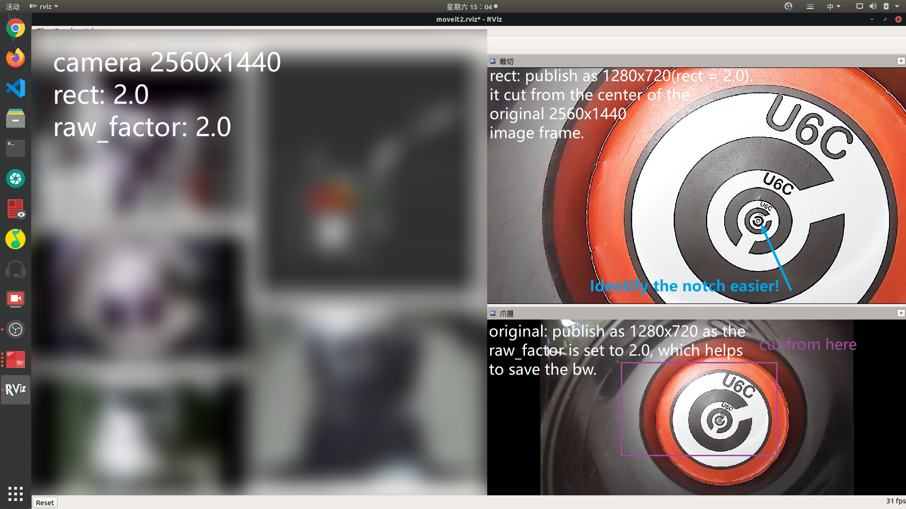

ROS OpenCV camera driver (Fork from https://github.com/OTL/cv_camera)
========================

It is very easy to capture video device if we use `cv::VideoCapture` of OpenCV.

If you are searching ROS2 driver, check [here](https://github.com/Kapernikov/cv_camera)

## What I Modified (by [@ludoux](github.com/ludoux))

### rect / cut & zoom 放大镜（裁切放大）

We have a task of distinguishing the smallest notch in pictures. This feature can cut a area from the center of the original camera image and publish it to another topic named "rect", which can help the operator to identify the notch in the laptop screen easier. 

`~rect` (*double*, default: 1.0) set it greater than 1.01 to activate it, and I suggest it to be 2.0 . When the original image topic is 2560x1440 and the rect is 2.0, it will cut the 1280x720 from the center of the original image and publish it to rect topic.

`~raw_factor` (*double*, default: 2.0) compress the raw topic in order to save bandwidth. If the raw_factor is set to 2.0 and the original image topic is 2560x1440, it will be compressed to 1280x720. 



### rotate 180° 画幅旋转180度

It's useful when the camera must be rotated due to some installation problems.

`~rotate` (*int*, default: 0) set it to 1 to activate it.

### compress 画幅压缩

It seems that only few cameras can't show full frame when opened by lower resolution. This feature can help to show full frame with lower resolution in order to save bandwidth.

`~compress_height` (*int*, default: 0) set it to *0 < compress_height < original height* to activate it. For example, 480 or 360 as you want.

cv_camera_node
------------------

This node uses [camera_info_manager](http://wiki.ros.org/camera_info_manager) for dealing with camera_info.
If no calibration data is set, it has dummy values except for width and height.

### Publish

* `~image_raw` (*sensor_msgs/Image*)
* `~camera_info` (*sensor_msgs/CameraInfo*)

### Service

* `~set_camera_info` (*sensor_msgs/SetCameraInfo*)

### Parameters

* `~rate` (*double*, default: 30.0) – publish rate [Hz].
* `~device_id` (*int*, default: 0) – capture device id.
* `~device_path` (*string*, default: "") – path to camera device file, e. g. `/dev/video0`.
* `~frame_id` (*string*, default: "camera") – `frame_id` of message header.
* `~image_width` (*int*) – try to set capture image width.
* `~image_height` (*int*) – try to set capture image height.
* `~camera_info_url` (*string*) – url of camera info yaml.
* `~file` (*string*, default: "") – if not "" then use movie file instead of device.
* `~capture_delay` (*double*, default: 0) – estimated duration of capturing and receiving the image.
* `~rescale_camera_info` (*bool*, default: false) – rescale camera calibration info automatically.
* `~camera_name` (*bool*, default: same as `frame_id`) – camera name for `camera_info_manager`.

Supports CV_CAP_PROP_*, by below params.

* `~cv_cap_prop_pos_msec` (*double*)
* `~cv_cap_prop_pos_avi_ratio` (*double*)
* `~cv_cap_prop_frame_width` (*double*)
* `~cv_cap_prop_frame_height` (*double*)
* `~cv_cap_prop_fps` (*double*)
* `~cv_cap_prop_fourcc` (*double*)
* `~cv_cap_prop_frame_count` (*double*)
* `~cv_cap_prop_format` (*double*)
* `~cv_cap_prop_mode` (*double*)
* `~cv_cap_prop_brightness` (*double*)
* `~cv_cap_prop_contrast` (*double*)
* `~cv_cap_prop_saturation` (*double*)
* `~cv_cap_prop_hue` (*double*)
* `~cv_cap_prop_gain` (*double*)
* `~cv_cap_prop_exposure` (*double*)
* `~cv_cap_prop_convert_rgb` (*double*)
* `~cv_cap_prop_rectification` (*double*)
* `~cv_cap_prop_iso_speed` (*double*)

And supports any props. Thanks to Hernan Badino!

* `~property_$(i)_code` (*int*) – set this code property using `~property_$(i)_value`, $(i) must start from 0.
* `~property_$(i)_value` (*double*) – the value to be set to `~property_$(i)_code`

If you want to set the property which code is 404 as 1,

```bash
rosrun cv_camera cv_camera_node _property_0_code:=404 _property_0_value:=1
```

If you want to set more, use `~property_1_code` and `~property_1_value`.

Nodelet
-------------------

This node works as nodelet (`cv_camera/CvCameraNodelet`).

Contributors
--------------------

PR is welcome. I'll review your code to keep consistency, be patient.

* Oleg Kalachev
* Mikael Arguedas
* Maurice Meedendorp
* Max Schettler
* Lukas Bulwahn
